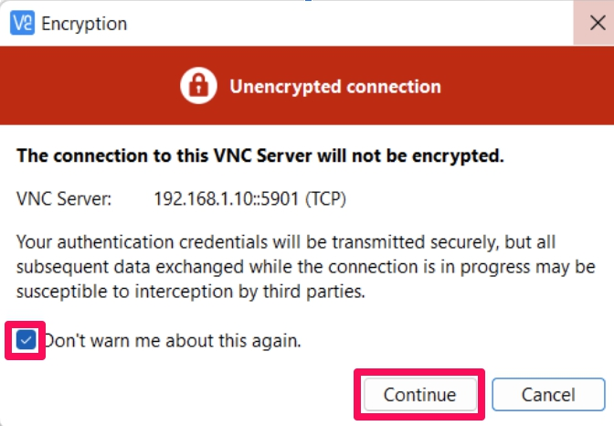
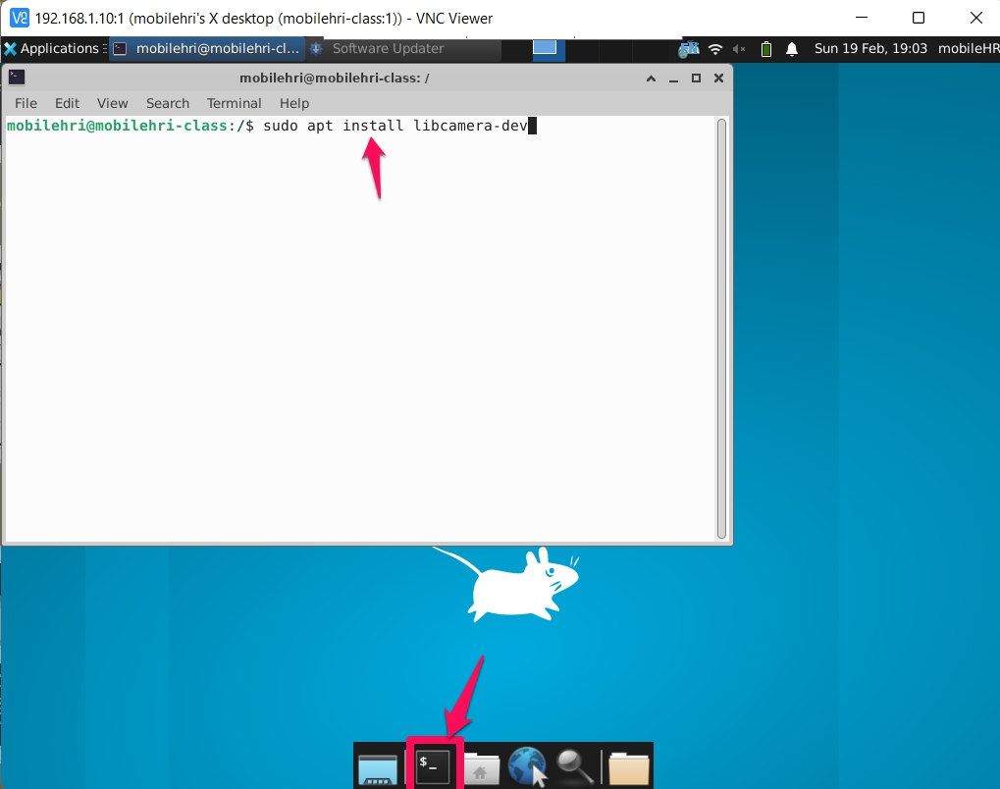

# Make the robot see
**List the names and NetID for your partners here.**
Qianti Min qm45  
Ananya Ganesh ag2227  
Calvin Tirrell cat248  
Jonah Brucker-Cohen jb2662  

Build off of Lab 3 from last week. This week's material can be done rather quickly.


## Prep

### For this lab, you will need:
1. Your laptop
2. Pi Camera

### Before you come to the lab on Thursday, please do the following:
1. Install VNC viewer from [here](https://www.realvnc.com/en/connect/download/viewer/) if you haven't. 

### Deliverables for this lab are: 

0. A screenshot of the working VNC viewer with a working image view.

1. Answers to the reflection questions in Part D. 

### The Report 
This README.md page in your own repository should be edited to include the work you have done (the deliverables mentioned above). Following the format below, you can delete everything but the headers and the sections between the **stars**. Write the answers to the questions under the starred sentences. Include any material that explains what you did in this lab hub folder, and link it in your README.md for the lab.

## Lab Overview
For this assignment, you are going to:

A) [Connect your camera](#-a-connect-your-camera)

B) [Connect to your Pi (VNC Viewer)](#part-b-connect-to-your-pi-through-vnc-viewer)

C) [People Detection](#part-c-people-detection)

Labs are due on Tuesdays before class. Make sure this page is linked to on your main class hub page.

## Part A. Connect your camera
Plug in the Pi camera to your RPi.

## Part B. Connect to your Pi through VNC Viewer
Start VNC Viewer, if prompted to sign in, "select Use VNC without signing in" in the bottom.

In the text box "Enter a VNC Server address or search", type in `Your_RPi_IP:1` (e.g. `10.56.131.31:1`).
> When prompted "server not encrypted", click "continue"


**Password**: `student`

You should now log in to your Pi through VNC Viewer.

> 

Open a terminal, install `libcamera-dev`.

```bash
sudo apt install libcamera-dev
```
> 

## Part C. People Detection
First, let's test if your camera is working properly. 
```bash
# In a terminal in VNC Viewer
cd
curl -LJO https://raw.githubusercontent.com/FAR-Lab/Mobile_HRI_Lab_Hub/main/Lab4/test_camera.py
python3 test_camera.py
```
**Please include a screenshot of the working VNC viewer with a working image view.**


This exercise is based on this [The Data Frog Tutorial](https://thedatafrog.com/en/articles/human-detection-video/#:~:text=People%20detection,work%20well%20in%20other%20cases.) online. Your CPU will get toasty, so put on a **heat sink**. 

```
# In a terminal in VNC Viewer
curl -LJO https://raw.githubusercontent.com/FAR-Lab/Mobile_HRI_Lab_Hub/main/Lab4/people_detection.py
python3 people_detection.py
```

Optional: Another example you can try is from [PyTorch](https://pytorch.org/tutorials/intermediate/realtime_rpi.html) (installed already on your system). You will need to write a few lines of code to load the labels yourself. 

## Part D. Reflection

Reflect on the following questions:

1. For your favorite prototyped interaction that you have thought of so far, reflect upon how a camera connected to your Pi could be useful.
We think it could be useful for the following two scenarios - 
- Autonomous shopping cart - In this case, the camera connected to the pi could capture the items in the shopping list and assist the user in speedy shopping
- Assisted walker for senior citizens - In this case, the camera connected to the pi would capture the obstacles in the way of the senior citizens.

2. What issues do you foresee with this setup? 
  
The biggest issue with the setup is that the camera is quite laggy and does not accurately detect people. We would need to have a faster camera connection and a better computer vision model to detect people. 
 
3. How is the temperature? How is the speed? How is the connection?
- Temperature - Pi tends to get a little hot since we forgot to add the CPU heatsink. 
- Speed - Camera is laggy, super slow.
- Connection - a little unstable due to the current method of connecting the camera. 

4. How is the view? Would it capture what you might need to see for your prototyped interaction (in question 1)?  

The view is quite clear - even with some latency. Makes it hard to detect people for our usecases. the accuracy of the detection is questionable.

Labs are due on Tuesdays before class. Make sure this page is linked to on your main class hub page.

### Again, deliverables for this lab are: 

0. A screenshot of the working VNC viewer with a working image view.

1. Answers to the reflection questions in part D. 

